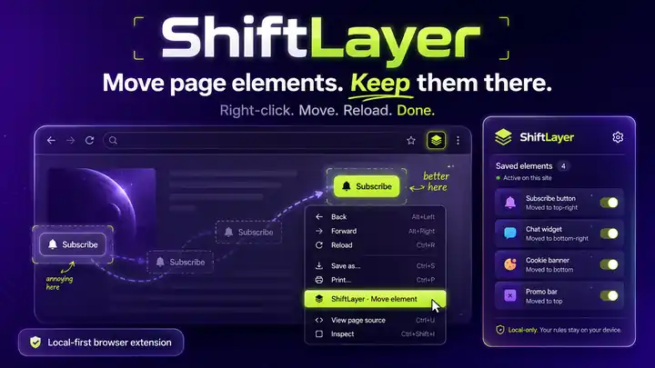

# ShiftLayer

[](CHANGELOG.md)
[](https://github.com/Dadmin88/shiftlayer/actions/workflows/ci.yml)
[](LICENSE)

**Your web. Your layout.**

<p align="center">
  
</p>

<p align="center">
  <strong>Right-click → Move → Reload → Done.</strong><br>
  <a href="assets/shiftlayer-demo.mp4">Watch the full-quality MP4</a>
</p>

ShiftLayer is a local-first browser extension that lets you move annoying or inconvenient page elements without removing them. Right-click a button, toolbar, panel, or other element, choose **ShiftLayer · Move element**, drag it somewhere better, and ShiftLayer remembers the change for that page.

The website keeps the real DOM node and its event handlers. ShiftLayer applies a visual translation instead of re-parenting the element, which is significantly less likely to upset React, Vue, Svelte, or other framework-managed pages.

## What it does

<p align="center">
  
</p>

- Right-click any normal web-page element and choose **ShiftLayer · Move element**.
- Drag the highlighted element, then drop it to save.
- Use arrow keys for 1 px nudges or Shift + arrow for 10 px nudges.
- Press Enter to save or Escape to cancel.
- Saved positions are reapplied on reload.
- Dynamic pages are watched with a bounded/debounced MutationObserver so recreated elements can be found again.
- Right-click a moved element and choose **ShiftLayer · Reset element** to restore it.
- The popup shows moved elements for the current page, total customizations for the current origin, per-item reset, and **Reset this site**.
- Query strings and hashes are ignored when scoping a page. Pathnames are not.

## Privacy

ShiftLayer is intentionally boring about data:

- no analytics
- no accounts
- no remote code
- no network requests
- no telemetry
- no form values, password values, textarea contents, contenteditable contents, or general page text are persisted

The extension stores only what is needed to re-identify an element and reapply a move: origin/path scope, structural selectors and a small set of stable attributes, a short label derived from those attributes, and the x/y movement vector. Everything lives in `chrome.storage.local` on the current browser profile.

Because ShiftLayer must work on arbitrary websites, its content script is declared for normal `http://` and `https://` pages. Browser-owned pages such as `chrome://`, extension stores, and other protected surfaces cannot be modified by normal extensions.

## How movement works

ShiftLayer deliberately does **not** move a node to another place in the DOM. It uses the CSS individual `translate` property with an `!important` inline declaration while preserving the element's original inline translate value for reset. CSS `translate` composes independently from the older `transform` property, so ordinary site transforms and hover animations generally continue to work.

This leaves the element's original layout slot in place. That tradeoff is intentional for the MVP: behavior preservation beats aggressive reflow. A later `Relocate` mode can explore layout-aware reflow separately.

## Element re-identification

A saved fingerprint prefers, in order:

1. a stable unique `id`
2. stable testing/automation attributes such as `data-testid`, `data-test`, `data-cy`, and `data-qa`
3. selected semantic attributes such as `aria-label`, `name`, `role`, `title`, and `type`
4. a small set of stable class names when unique
5. a bounded `nth-of-type` CSS path fallback

Obvious hash-like/generated tokens are avoided. On restoration, ShiftLayer tries saved selectors in order and scores ambiguous matches using the saved attributes.

This is best-effort by design. Websites can change their markup at any time.

## Install locally in Chromium

1. Run `npm run build` if Node is available, or load the repository root directly.
2. Open `chrome://extensions` or the equivalent extensions page in your Chromium-based browser.
3. Enable **Developer mode**.
4. Choose **Load unpacked**.
5. Select the project's `dist/` directory if built, otherwise the repository root.
6. Open a normal website, right-click an element, and choose **ShiftLayer · Move element**.

For source-only iteration the repository root is valid. `dist/` is the canonical packaged build when Node is available.

## Development

ShiftLayer has no runtime or build dependencies. Requirements: Node.js 20+ for local checks.

```bash
npm test
npm run lint
npm run build
# or all three
npm run check
```

The GitHub Actions **CI** workflow runs `npm run check` on every push and pull request to `main`.

## Manual QA checklist

- Move a plain `<button>` and verify it still clicks after moving.
- Reload and verify the button returns to the saved visual position.
- Move an icon nested inside a button and verify ShiftLayer chooses the interactive button ancestor.
- Move an element on a React/Vue/Svelte SPA and navigate away/back.
- Verify query/hash changes do not create a second scope.
- Verify pathname changes do create a separate scope.
- Move with pointer drag, then separately with arrow keys + Enter.
- Start a move and press Escape. Verify the previous position is restored.
- Right-click a moved element and reset it.
- Reset one item from the popup.
- Reset the entire origin from the popup.
- Remove/recreate a moved DOM node and verify the saved move reapplies.
- Confirm password/form values are absent from `chrome.storage.local`.
- Confirm no requests are emitted by ShiftLayer in DevTools Network.
- Verify protected browser pages fail gracefully rather than producing broken UI.

## Known limitations

- Moving is visual, not layout-reflowing; the original layout slot remains occupied.
- A site that itself uses the CSS individual `translate` property can have an edge-case conflict.
- Major website redesigns can invalidate an element fingerprint.
- Cross-origin iframes and closed Shadow DOMs are subject to normal browser-extension boundaries.
- Firefox packaging/review details are not completed in v0.1.

## Roadmap

See [`docs/PLAN.md`](docs/PLAN.md) for the phased plan. The short version:

- stronger undo/history and broken-selector repair
- Hide
- Resize
- Pin / keep visible while scrolling
- Move to corner / snap guides
- per-site editor and enable/disable controls
- origin-wide vs path-specific rules
- export/import and optional browser sync
- Firefox support and store packaging
- optional layout-aware `Relocate` mode distinct from safe visual movement

## License

MIT. See [`LICENSE`](LICENSE).
